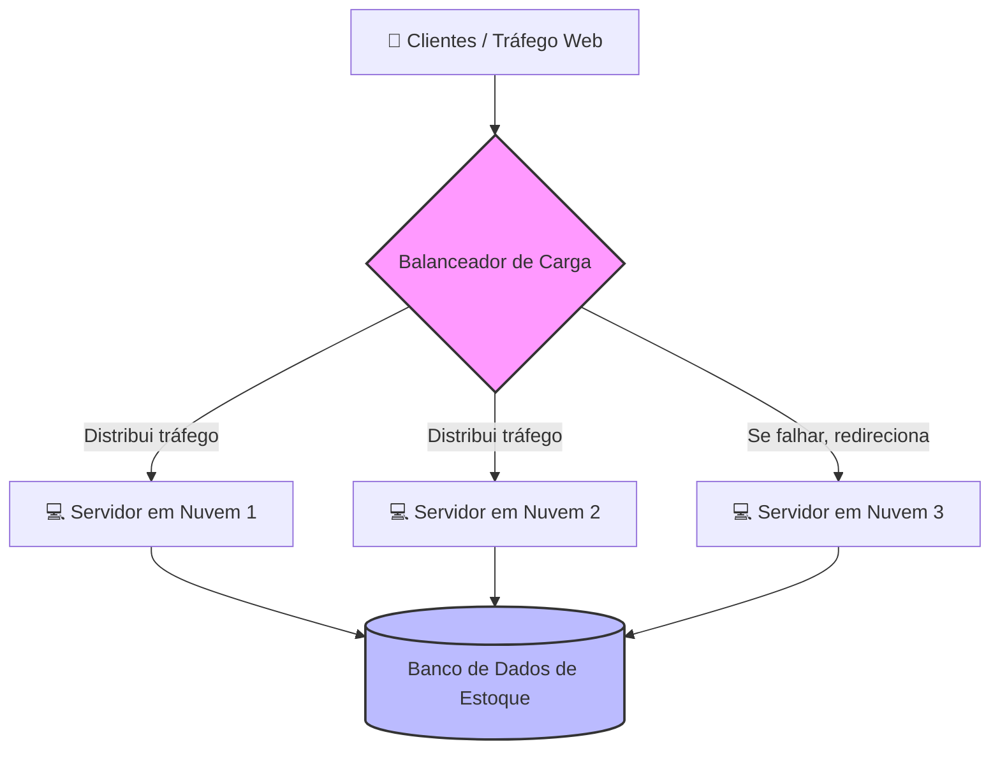
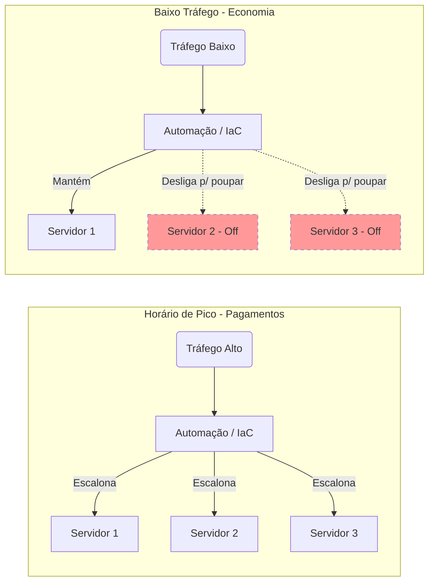

# Estudo de Caso: Supermercado Online
## Análise de Infraestrutura focada nos pilares de Custo e Confiabilidade

O presente estudo analisa um e-commerce supermercadista que enfrenta altos picos de acesso durante as semanas de pagamento de salários e pensões. O workload crítico precisa garantir alta disponibilidade do carrinho de compras e sincronia de estoque em tempo real para evitar vendas sem saldo. Simultaneamente, busca-se eficiência financeira através do manejo inteligente dos recursos computacionais durante janelas de baixo tráfego (como a madrugada).

### 1. Pilar de Confiabilidade

*   **O Cenário:** Como garantir que o banco de dados atualize o estoque em tempo real, sem falhar, durante os picos de acesso repentinos?
*   **Aplicação Prática:** Em vez de depender de um único servidor central e vulnerável, a arquitetura utiliza múltiplos **servidores em nuvem** (máquinas virtuais) menores trabalhando em conjunto. Para lidar com a avalanche de acessos, utiliza-se um **Balanceador de Carga** na entrada da aplicação. Ele atua como um "guarda de trânsito", recebendo todo o tráfego de clientes e distribuindo o peso igualmente entre os servidores disponíveis. Caso uma máquina apresente falha, o balanceador redireciona os usuários instantaneamente para as máquinas saudáveis, garantindo que o carrinho de compras e o estoque continuem operando sem interrupções.

### 2. Pilar de Custo

*   **O Cenário:** Durante a madrugada, a taxa de compras cai drasticamente. Como evitar o desperdício financeiro mantendo a mesma quantidade de servidores ligados 24 horas por dia?
*   **Aplicação Prática:** Aplica-se o conceito de elasticidade da nuvem através da **Infraestrutura como Código (IaC)** e ferramentas de **Escalonamento Automático**. A infraestrutura não é estática, mas dinâmica e programada para monitorar a demanda. Durante a madrugada, as regras de automação desligam os servidores sobressalentes, reduzindo os custos ao mínimo necessário. Assim que o dia amanhece e o tráfego volta a subir, os scripts de IaC provisionam novas instâncias automaticamente, garantindo que o supermercado pague apenas pelos recursos computacionais que realmente consome.

